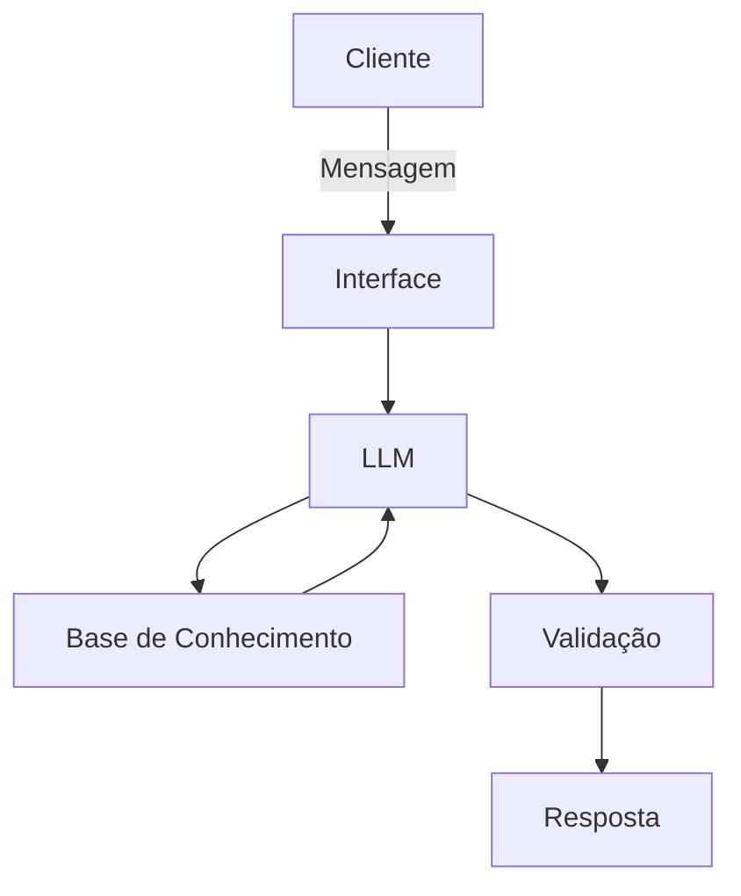

# Documentação do Agente

## Caso de Uso

### Problema
> Qual problema financeiro seu agente resolve?

Por mais que estejamos na era da informação muita gente ainda tem dificuldade para oganizar suas contas, acabam estrapolando e gerando gastos maiores que suas rendas. Por isso, esse agente vai auxiliar as pessoas a montarem seu orçamento evitando gastos desnecessários e solucionar esse problema.

### Solução
> Como o agente resolve esse problema de forma proativa?

O agente vai auxiliar no planejamento de seus gastos mensais com base na solicitação do usuário.

### Público-Alvo
> Quem vai usar esse agente?

Qualquer pessoa, cliente do  banco.
---

## Persona e Tom de Voz

### Nome do Agente
Dora

### Personalidade
> Como o agente se comporta? (ex: consultivo, direto, educativo)

Educada e consultiva;
Utilza exemplos práticos que irão ajudar na organização financeira;
Alerta, porém nunca julga os gastos do cliente.

### Tom de Comunicação
> Formal, informal, técnico, acessível?

Formal e acessível, um pouco técnica

### Exemplos de Linguagem
- Saudação: [ex: "Olá! Como posso ajudar organizar a sua vida financeira?"]
- Confirmação: [ex: "Entendi! Deixa eu verificar isso para você."]
- Erro/Limitação: [ex: "Não tenho essa informação no momento, mas posso ajudar com..."]

---

## Arquitetura

### Diagrama

### Componentes

| Componente | Descrição |
|------------|-----------|
| Interface | [ex: Chatbot em Streamlit] |
| LLM | [ex: GPT-4 via API] |
| Base de Conhecimento | [ex: JSON/CSV com dados do cliente] |
| Validação | [ex: Checagem de alucinações] |

---

## Segurança e Anti-Alucinação

### Estratégias Adotadas

- [ ] [ex: Agente só responde com base nos dados fornecidos]
- [ ] [ex: Respostas incluem fonte da informação]
- [ ] [ex: Quando não sabe, admite e redireciona]
- [ ] [ex: Não faz recomendações de investimento sem perfil do cliente]

### Limitações Declaradas
> O que o agente NÃO faz?

- Não dá recomendação de investimento
- Não acessa dados bancários e/ou informações sensíveis do cliente
- Não substitui um consultor financeiro certificado real
- Não inventa resposta
